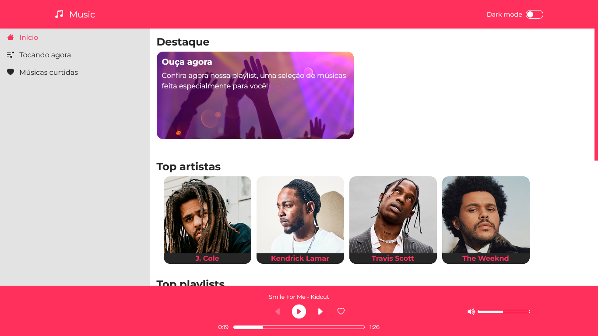

<h1 align="center">
    
</h1>

<h2 align='center'><a href='https://wendellwcl.github.io/PlayerDeMusica/' target='_blank' style='display: block; color: #FF305C; font-weight: bold; margin: 30px'>Visitar projeto.</a></h2>

<h2 style='color: #FF305C'>Créditos sobre as músicas utilizadas:</h2>

Todas as músicas utilizadas no projeto foram encontradas na plataforma <a href='https://uppbeat.io/' target='_blank'>uppbeat.io</a>.

<ul style='display: flex; justify-content: space-around; margin-bottom: 30px'>
    <li style='margin-right: 30px'>
        Música: Smile For Me  
        Autor: Kidcut  
        Music from Uppbeat (free for Creators!):  
        <a href='https://uppbeat.io/t/kidcut/smile-for-me' target='_blank'>https://uppbeat.io/t/kidcut/smile-for-me</a>  
        License code: 4TJIHW2NY9NOPUOV
    </li>
    <li style='margin-right: 30px'>
        Música: Oly  
        Autor: Walz  
        Music from Uppbeat (free for Creators!):  
        <a href='https://uppbeat.io/t/walz/oly' target='_blank'>https://uppbeat.io/t/walz/oly</a>  
        License code: HW7DXDL0GNPWYGQV
    </li>
    <li style='margin-right: 30px'>
        Música: Jump Around  
        Autor: All Good Folks  
        Music from Uppbeat (free for Creators!):  
        <a href='https://uppbeat.io/t/all-good-folks/jump-around' target='_blank'>https://uppbeat.io/t/all-good-folks/jump-around</a>  
        License code: UTSPP91XSBYIWNO3
    </li>
</ul>

<h2 style='color: #FF305C'>Descrição do projeto:</h2>

    Resolvi encarar o desafio de criar um player de música, para aprender e praticar sobre a utilização de áudios.
    Neste projeto tive a oportunidade de desenvolver várias funcionalidades ao redor dessa ideia principal, criando tudo do zero.
    Mas não só isso, também produzi uma aplicação aproveitando todo o contexto, com algumas outras mecânicas que vale a pena conferir: 
    <a href='https://wendellwcl.github.io/PlayerDeMusica/' target='_blank' style='display: block; color: #FF305C; font-weight: bold; margin: 30px'>Clique aqui para acessar o projeto.</a>

    

<h2 style='color: #FF305C'>Tecnologias utilizadas:</h2>
<ul style='list-style: none; display: flex'>
    <li style='display: flex; flex-direction: column; align-items: center; margin-right: 30px'>
        
        HTML
    </li>
    <li style='display: flex; flex-direction: column; align-items: center; margin-right: 30px'>
        
        CSS
    </li>
    <li style='display: flex; flex-direction: column; align-items: center; margin-right: 30px'>
        
        JavaScript
    </li>
    <li style='display: flex; flex-direction: column; align-items: center; margin-right: 30px'>
        
        Bootstrap
    </li>
    <li style='display: flex; flex-direction: column; align-items: center; margin-right: 30px'>
        
        React
    </li>
</ul>